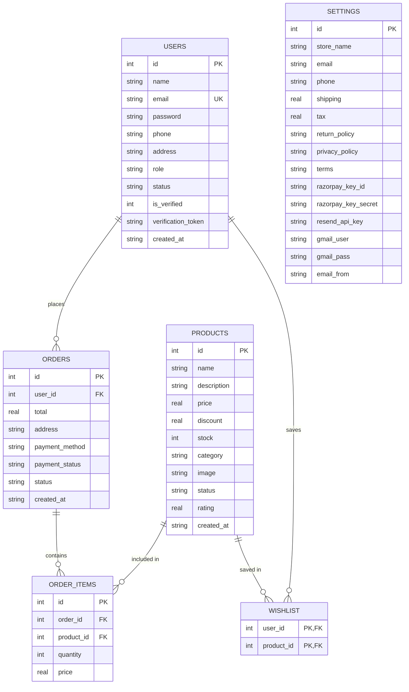

# JP Store — Project Documentation & Architecture Guide (`info.md`)

JP Store is a full-stack, responsive e-commerce web application engineered for premium stationery, artisanal desk accessories, and executive lifestyle goods. Built with a decoupled React/Vite frontend and an Express/SQLite backend, it features Razorpay payment processing, dual-tier transactional emailing (Resend + Gmail SMTP fallback), SweetAlert2 UI interactions, and an executive administration dashboard.

---

## 1. System Architecture Overview

```
                        ┌─────────────────────────────────────────┐
                        │          React 18 + Vite Client         │
                        │      (Port 5173 / SweetAlert2 UI)       │
                        └────────────────────┬────────────────────┘
                                             │ HTTP / REST / JSON
                                             │ Bearer JWT Auth
                                             ▼
                        ┌─────────────────────────────────────────┐
                        │           Express 4 Backend             │
                        │      (Port 4000 / Node.js Engine)       │
                        └───┬─────────────┬─────────────┬─────────┘
                            │             │             │
              ┌─────────────┴──┐   ┌──────┴──────┐   ┌──┴─────────────┐
              │ SQLite Database│   │  Razorpay   │   │   Dual-Tier    │
              │(better-sqlite3)│   │   Gateway   │   │  Email Engine  │
              │  jp-store.db   │   │  HMAC SHA256│   │ Resend + Gmail │
              └────────────────┘   └─────────────┘   └────────────────┘
```

- **Frontend (`client/`)**: Modern Single Page Application (SPA) powered by React 18, Vite 5, React Router 6, Axios, Lucide React icons, and SweetAlert2.
- **Backend (`server/`)**: Modular REST API powered by Node.js, Express, `better-sqlite3`, JWT, BcryptJS, and Multer for multipart file uploads.
- **Database Engine**: Persistent single-file SQLite database located at `server/jp-store.db`.
- **Payment Processing**: Razorpay SDK with dynamic order creation and server-side HMAC SHA-256 signature verification.
- **Mailing Engine**: Dual-tier delivery system. Dispatches primary emails via Resend API and automatically falls back to Gmail SMTP via Nodemailer if Resend is unconfigured or encounters an error.

---

## 2. Technology Stack & Dependencies

### Frontend (`client/package.json`)
| Dependency | Version | Purpose |
| :--- | :--- | :--- |
| `react` | `^18.3.1` | Core UI Component Library |
| `react-dom` | `^18.3.1` | DOM Renderer for React |
| `react-router-dom`| `^6.28.0` | Client-Side Routing and Navigation |
| `axios` | `^1.7.7` | HTTP Client with JWT interceptors |
| `lucide-react` | `^0.468.0` | Clean Modern Iconography |
| `sweetalert2` | `^11.14.0` | Branded Dialogs, Alerts, Prompts, and Toasts |
| `vite` | `^5.4.10` | High-Performance Development & Production Bundler |

### Backend (`server/package.json`)
| Dependency | Version | Purpose |
| :--- | :--- | :--- |
| `express` | `^4.21.0` | HTTP Web Framework |
| `better-sqlite3` | `^11.3.0` | High-Performance Synchronous SQLite3 Driver |
| `jsonwebtoken` | `^9.0.2` | Secure JWT Authentication Tokens |
| `bcryptjs` | `^2.4.3` | Password Hashing (10 rounds) |
| `multer` | `^1.4.5-lts.1` | File Upload Handler for Product Images |
| `cors` | `^2.8.5` | Cross-Origin Resource Sharing Middleware |
| `razorpay` | `^2.9.4` | Razorpay Payment Gateway SDK |
| `resend` | `^4.0.1` | Resend Primary Transactional Email SDK |
| `nodemailer` | `^6.9.15` | Gmail SMTP Fallback Mail Transport |
| `dotenv` | `^16.4.5` | Environment Variable Management |

---

## 3. Database Architecture & Schema

The persistent SQLite database is located at [`server/jp-store.db`](file:///c:/Users/Jeevadharan/Documents/Pretty%20Picks/jp-store/server/jp-store.db). Foreign key enforcement is enabled via `PRAGMA foreign_keys = ON;`.



### Table Definitions & Foreign Key Rules
1. **`users`**:
   - Stores customer and administrator accounts.
   - `is_verified`: `1` for email-verified accounts, `0` for unverified accounts.
   - `verification_token`: 24-byte crypto hexadecimal token for email verification.
2. **`products`**:
   - `status`: `'active'` (visible in customer store) or `'inactive'` (hidden from customer store, managed by admin).
3. **`orders`**:
   - `FOREIGN KEY(user_id) REFERENCES users(id) ON DELETE CASCADE`.
   - Tracks total amount, delivery address, payment method, payment status (`'Paid'`, `'Pending'`, `'Refund pending'`), and order fulfillment status (`'Ordered'`, `'Processing'`, `'Shipped'`, `'Delivered'`, `'Cancelled'`, `'Returned'`).
4. **`order_items`**:
   - `FOREIGN KEY(order_id) REFERENCES orders(id) ON DELETE CASCADE`.
   - `FOREIGN KEY(product_id) REFERENCES products(id) ON DELETE CASCADE`.
5. **`wishlist`**:
   - Composite Primary Key `(user_id, product_id)`.
   - Cascading deletions on both user and product deletion.
6. **`settings`**:
   - Single-row table (`id = 1`) storing store metadata, tax rates, shipping fees, policy texts, Razorpay credentials, and email credentials.

---

## 4. Key Functional Features

### A. Customer Experience (Storefront)
- **Product Discovery**: Browse products with instant category filter chips and real-time query search.
- **Product Details**: High-resolution imagery, discounted pricing calculator, stock levels, and review ratings.
- **Interactive Shopping Cart**: Client-side cart persistence via `localStorage` with dynamic pricing and item quantity management.
- **Wishlist Sync**: One-click heart toggle that syncs directly to the user's database record when authenticated.
- **Razorpay Checkout**: Seamless modal checkout supporting UPI, Credit/Debit Cards, Net Banking, and Wallets, alongside Cash on Delivery.
- **Account Verification**: Registration generates a verification token and sends a welcome email with a direct `/verify?token=...` link. Users can view their verified status badge and resend verification emails from My Account.
- **Order Management & Cancellation**: Review past orders with item breakdown and one-click order cancellation with automated refund status updates.

### B. Administrator Dashboard (`/admin`)
- **Executive Navigation & Layout**: Sleek obsidian dark sidebar (`#0f172a`) with instant routing.
- **Real-Time KPI Dashboard**:
  - Total Orders
  - Sales / Revenue (computed from Paid orders)
  - Product Catalog Size
  - Total Registered Customers
  - Pending Orders
  - Low Stock Alerts (`stock <= 5`)
  - Cancelled & Returned Orders
  - Recent 8 Orders Table
- **Product Inventory Management**:
  - Modal-based Product Creator & Editor (Name, Category auto-suggest, Price, Discount, Stock, Status, Description, Image file upload + live preview).
  - Quick inline **Activate / Deactivate** toggles.
  - Deletion with cascading foreign key cleanup.
- **Order Processing**: Update order status using SweetAlert2 dropdown selector (`Ordered`, `Processing`, `Shipped`, `Delivered`, `Cancelled`, `Returned`).
- **Customer Control**: Review customer order counts and spending history; block or unblock accounts with confirmation.
- **Credentials & Store Settings**: Manage store policies, tax %, shipping fee, Razorpay keys, Resend API key, and Gmail SMTP credentials directly from the UI.

### C. SweetAlert2 Theme
- **Zero Browser Popups**: All native browser `alert()`, `confirm()`, and `prompt()` functions are replaced with SweetAlert2.
- **Design Alignment**: Styled with `Plus Jakarta Sans`, `Outfit`, obsidian slate `#0f172a`, and indigo `#2563eb`.
- **Toast Notifications**: Non-intrusive top-right toasts for cart actions, wishlist toggles, and status updates.

### D. Flipkart & Amazon Style Split Address & Location Fetch
- **Structured Address System**: Multi-field address model consisting of Recipient Name, 10-digit Mobile Phone (with `+91` badge), 6-digit PIN code, Flat/Building, Area/Street, Landmark (Optional), City, State dropdown (all 36 Indian states & UTs), and Address Type (🏠 Home / 🏢 Work / 📍 Other).
- **GPS Location Detection**: Browser `navigator.geolocation` paired with `GET /api/geocode/reverse` uses OpenStreetMap Nominatim and BigDataCloud to auto-populate Area, City, State, and PIN code on click.
- **PIN Code Auto-Lookup**: Indian Postal API integration (`GET /api/geocode/pincode/:pincode`) automatically resolves District/City and State in real-time as soon as 6 digits are typed.
- **Multi-Address Management**: Users can store, select, edit, and delete multiple delivery addresses in both Checkout and their Account Profile.

### E. Payment Gateway (Razorpay Test Mode)
- **Active Test Mode Sandbox**: Full support for Razorpay Test Mode with `rzp_test_...` credentials.
- **Test Mode Checkout**: Displays prominent `[TEST MODE]` badges and helper instructions for test card numbers (`4111 1111 1111 1111`, CVV `123`) and test UPI handles (`success@razorpay`).
- **Credential Verification Tool**: `POST /api/admin/test-razorpay` allows administrators to test and verify their Razorpay Key ID and Secret against the live Razorpay API directly from the Admin Settings tab.
- **End-to-End Signature Verification**: Generates authentic HMAC SHA-256 signatures and verifies payments securely on the server.

### F. Dual-Tier Email Delivery System
- **Resend (Primary)**: Dispatches via official SDK.
- **Gmail SMTP (Fallback)**: Automatically triggered if Resend fails or lacks an API key.
- **Non-Blocking Architecture**: Email generation occurs asynchronously so network or credential failures never block user checkout or registration.
- **HTML Templates**:
  - **Account Verification**: Welcome email with direct account confirmation link.
  - **Order Confirmation & Tax Invoice**: Branded tax invoice containing itemized table, subtotal, shipping, tax, grand total, and delivery details.

---

## 5. API Reference Guide

### Authentication & Account
| Method | Endpoint | Access | Description |
| :--- | :--- | :--- | :--- |
| `POST` | `/api/auth/register` | Public | Registers user, hashes password, generates verification token, dispatches email |
| `POST` | `/api/auth/login` | Public | Validates credentials, returns JWT token & user object |
| `GET` | `/api/auth/verify` | Public | Validates `?token=...` query param and marks account verified (`is_verified = 1`) |
| `POST` | `/api/auth/resend-verification` | User | Generates a new verification token and re-sends the verification email |
| `GET` | `/api/me` | User | Returns authenticated profile, phone, and saved addresses |
| `PUT` | `/api/me` | User | Updates name, phone, and structured saved delivery addresses |

### Geocoding & Location
| Method | Endpoint | Access | Description |
| :--- | :--- | :--- | :--- |
| `GET` | `/api/geocode/reverse` | Public | GPS coordinates (`lat`, `lon`) -> Reverse geocode to Area, City, State, PIN |
| `GET` | `/api/geocode/pincode/:pincode`| Public | 6-digit Indian PIN code -> Returns District/City and State |

### Catalog & Products
| Method | Endpoint | Access | Description |
| :--- | :--- | :--- | :--- |
| `GET` | `/api/products` | Public | Returns active products (`status = 'active'`). Supports `?search=` and `?category=` |
| `GET` | `/api/products/:id` | Public | Returns single product details by ID |
| `GET` | `/api/categories` | Public | Returns list of distinct categories from active products |
| `GET` | `/api/admin/products` | Admin | Returns all products (both active and inactive) |
| `POST` | `/api/products` | Admin | Creates product (supports multipart image upload) |
| `PUT` | `/api/products/:id` | Admin | Updates product details and optional new image |
| `PATCH` | `/api/admin/products/:id/status`| Admin | Toggles product status (`'active'` or `'inactive'`) |
| `DELETE` | `/api/products/:id` | Admin | Atomically deletes product and cascading wishlist/order references |

### Orders & Checkout
| Method | Endpoint | Access | Description |
| :--- | :--- | :--- | :--- |
| `POST` | `/api/orders` | User | Places order with formatted split address, decrements inventory, and sends invoice |
| `GET` | `/api/orders` | User/Admin | Returns user's orders (or all orders if admin) with itemized products & addresses |
| `PUT` | `/api/orders/:id/status` | Admin | Updates order fulfillment status |
| `PUT` | `/api/orders/:id/cancel` | User/Admin | Cancels order and updates payment status to `'Refund pending'` |

### Payment Gateway (Razorpay)
| Method | Endpoint | Access | Description |
| :--- | :--- | :--- | :--- |
| `GET` | `/api/payment/config` | Public | Exposes public Razorpay Key ID |
| `POST` | `/api/payment/create-order` | User | Generates Razorpay order ID and amount in paise (Test/Live mode) |
| `POST` | `/api/payment/verify` | User | Validates HMAC SHA-256 payment signature |
| `POST` | `/api/admin/test-razorpay` | Admin | Tests Razorpay API credentials connectivity and returns test mode status |

### Admin & Settings
| Method | Endpoint | Access | Description |
| :--- | :--- | :--- | :--- |
| `GET` | `/api/admin/dashboard` | Admin | Returns real-time KPI metrics and recent orders |
| `GET` | `/api/admin/customers` | Admin | Returns customer list with order counts, spending, and verification status |
| `PUT` | `/api/admin/customers/:id/status`| Admin | Updates customer status (`'active'` or `'blocked'`) |
| `GET` | `/api/admin/payments` | Admin | Returns complete payment transactions log |
| `GET` | `/api/settings` | Public | Returns store settings, fees, policies, and public configurations |
| `PUT` | `/api/settings` | Admin | Updates store settings, Razorpay keys, and email credentials |

---

## 6. Environment Variables (`server/.env`)

Create or edit `server/.env` with your credentials:

```env
# Server Configuration
PORT=4000
JWT_SECRET=jp-store-change-this-secret

# Razorpay Payment Gateway (https://dashboard.razorpay.com/app/keys)
RAZORPAY_KEY_ID=rzp_test_your_key_id
RAZORPAY_KEY_SECRET=your_key_secret

# Resend Primary Email Service (https://resend.com/api-keys)
RESEND_API_KEY=re_your_resend_api_key
EMAIL_FROM=JP Store <onboarding@resend.dev>

# Gmail SMTP Fallback (https://myaccount.google.com/apppasswords)
GMAIL_USER=your_email@gmail.com
GMAIL_APP_PASSWORD=your_16_digit_app_password

# Client URL for verification links
APP_URL=http://localhost:5173
```

*(Note: Credentials can also be configured directly via the Admin Dashboard > Settings tab, which persist in the SQLite `settings` table).*

---

## 7. How to Run & Verify the Project

### Prerequisites
- Node.js (v18 or higher recommended)
- npm (v9 or higher)

### Installation
```bash
# Install root, server, and client dependencies
npm install
npm run install:all
```

### Starting the Development Servers
From the root directory, start both the backend and frontend concurrently:
```bash
npm run dev
```

Or run them in separate terminals:

**Backend Server** (`http://localhost:4000`):
```bash
cd server
node src.js
```

**Frontend Client** (`http://localhost:5173`):
```bash
cd client
npm run dev
```

### Building for Production
```bash
cd client
npm run build
```

### Running Automated Test Suite
The project includes an end-to-end integration test verifying all API flows, Razorpay endpoints, and email dispatch:
```bash
cd server
node run_full_verification.js
```

---

## 8. Default Credentials

- **Admin Account**: `admin@jpstore.com`
- **Admin Password**: `admin123`
- **Customer Registration**: Available on `/login` via the "Create Account" tab.
- **Admin Panel Access**: Available on `/admin` (or click the Dashboard icon in the navigation bar when logged in as an administrator).
